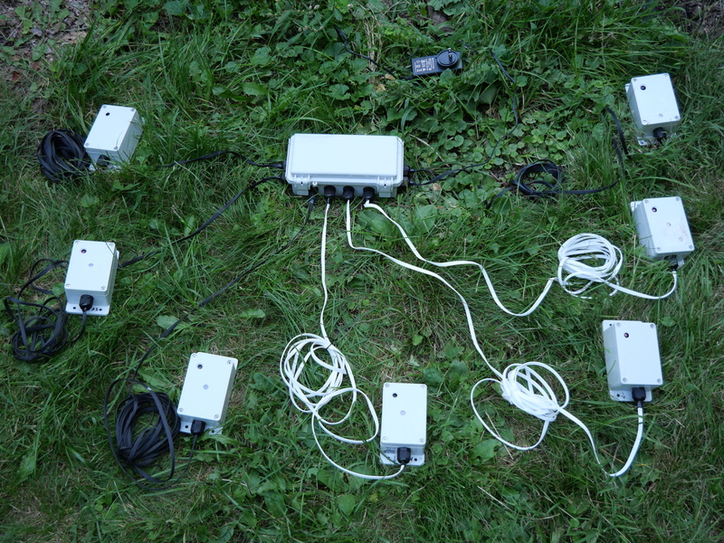
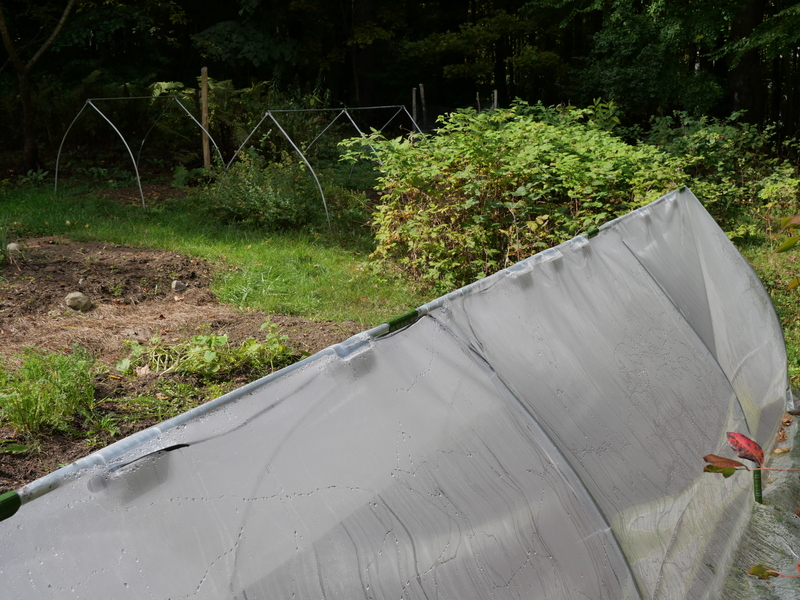
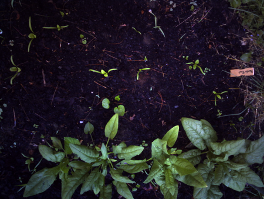
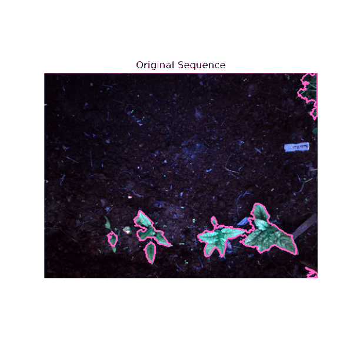
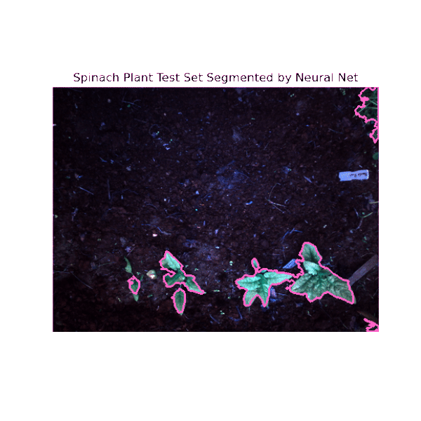
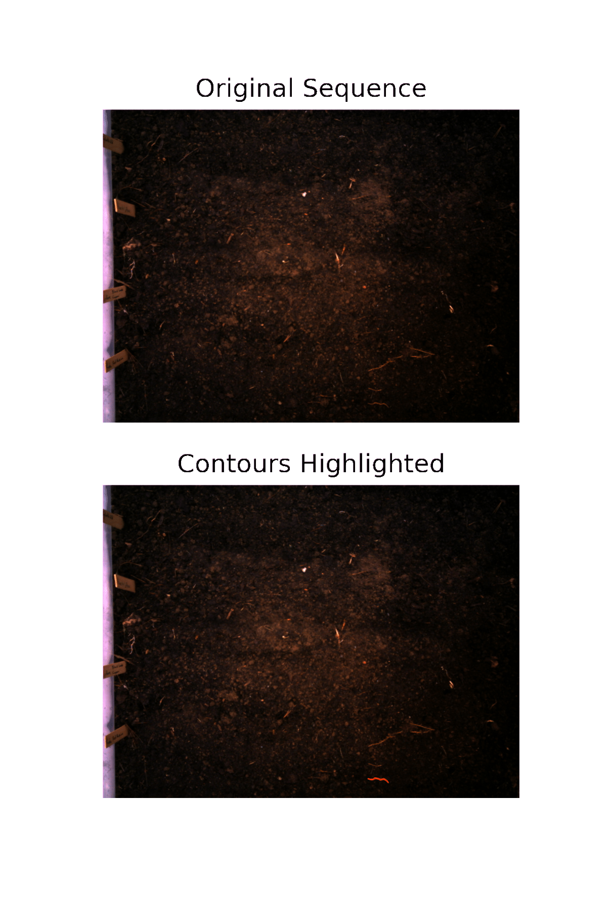

# Computer Vision for Farm Greenhouses

## Abstract
Computer vision technology for farms has matured quickly in recent years, due largely to healthy interest and funding. A full stack engineering solution for this problem consists of at least three main parts: controlling costs for firmware and hardware construction, finding or creating appropriate training sets for desired tasks, and engineering applications for useful model outputs. Data engineering and networking infrastructure are a necessary precondition for achieving these, but not strictly in the data science loop. Where the engineering, science, and art collide is data curation and interpretation, which is still a difficult and intensive manual process, requiring some knowledge of the data and what it represents. How the data is collected, the crucial first step, also influences the possibilities for analysis. Here we describe an extremely low cost, open-source, full stack computer vision system for farm greenhouses. First we'll discuss hardware construction, touch briefly on data collection in the field and it's challenges, then turn to training a segmentation neural net with publicly available datasets, and discuss a few applications of the combined system, like pest identification, and predicting growth curves for harvest yield and timing [Adak 2021, Riera 2021], pointing the way towards useful farm analytics dashboards.

## Lowering the Cost of Farm Research Cameras

Convincing farmers to adopt new technology, like analytics dashboards and on-farm cameras and sensors, is challenging for a number of reasons, and adds additional complexity to the task of designing the systems themselves. Hardware purpose built for laboratory environments will not withstand the harsh rigors of service in the field, even inside protected structures like greenhouses. Cameras, sensors and other hardware need to be ruggedized against heat and cold, weather, and moisture, which  clouds lenses and short-circuits microcontrollers. Hardware in the field also needs to contend with uncontrolled and varying conditions. Light levels span huge ranges in the outdoors, even from minute to minute. The biological eye has an enormous dynamic range of many orders of magnitude, which current cameras cannot hope to achieve. Therefore, working within limitations becomes a necessity, and can hopefully lead to novel and useful innovations. The most persistent pressure of deploying hardware on farms is cost. Farmers are willing to adopt new technology, and can see the benefits of emerging technologies, but farms are low profit-margin ventures, and farm owners must be strictly frugal in their capital investments in order to stay profitable.

In their paper on raspberry pi cameras used for plant phenotyping [Tovar 2018], the Danforth lab in St. Louis has significantly reduced the cost of manufacturing a workable plant capture camera. Besides the obvious uses and benefits to research, this platform serves as a good starting point [Fahlgren 2015] for developing an even lower cost camera that can be deployed commercially, and has the potential to add tremendous value to farms, with the extensive analytics that they will eventually enable. Of course, these analytics, and the foundational algorithms that underlie them, are the interesting part of agricultural data science, but progress on the algorithms has quickly outpaced progress on data capture. The algorithms are essentially ready for deployment on a large scale around the world, but companies that offer services to collect data from farms reliably are only beginning to appear and thrive. Both aerial and ground-based drone photography will likely be the most impactful modality of on-farm photography. But other modalities will have roles to play, based on the particular needs of the farm. Huge acreages will certainly come to rely even more heavily on satellite data, and ‘precision agriculture’, than they already have. But these sorts of analytics are not available to managers of small and medium sized farms. Small farms in particular have difficult hurdles to deployment, simply making the value proposition good enough is a challenge. Therefore, computer vision technologies for farms are going to be rather specialized as they begin to gain traction in the marketplace.

## Modalities of farm cameras

The benefits of stationary cameras distinguish them from more expensive options [Shakoor 2022]. Existing cameras start at around $50 and that doesn’t necessarily include all the needed programmability and connectivity desired of an on-farm camera system. Lowering the cost, while maintaining rugged resistance to dust and water is the prime goal. Using commercially available electrical housings reduces complexity and construction time. 3D printing would cut the cost of the housing by almost an order of magnitude. Wiring is used for power only, and wifi is used for data transfer since most greenhouses already have power and wifi available. The camera and circuit board itself is an esp32-cam, which costs roughly 5 US dollars, and includes the camera. Raspberry pi compute units and the additional camera can run between 50-70 US dollars or more. Granted, the camera quality, and compute capability are far higher, but the utility of a very cheap system is that many cameras can be used to blanket a high-value growing area (like a greenhouse), collecting data for months or years, with a negligable initial investment.

Figure 1. The power supply (and the cameras) are protected by commercially available electrical conduit boxes. Holes are drilled, and cable glands installed for wiring.   

Figure 2. Greenhouses (here in miniature form, at the scale of row cover) offer protection from the elements, and have the extra benefit of regulating aspects of the environment relevant to image collection. Disturbance of the soil and plants from wind and rain is neutralized, while light is diffused and is cast more evenly. Stationary cameras are exceedingly simple and can watch the same area for an entire season, or several seasons.   

Figure 3. An example frame of data collected of spinach plants.   

The promise of year round camera monitoring of farms is that it will allow farmers to see details and patterns in vast amounts of data. Analyzing these patterns can provide insight into the growth rates of various crops, in various locations around the farm, and predictions of crop yields for short time frames, hopefully up to a few weeks. It also opens the possibility of using optimization methods to help advise farmers on complex decisions. For example should you harvest tomorrow at 85% maturity and sell at $1.59/lb or wait one week and sell the crop at 95% maturity, but for $1.49/lb? It’s really not an easy math problem, and farmers don’t have time to spend on this. Pricing is too important and too complicated to rely on intuition. With small margins, farms need to be smart about pricing, and that includes taking into account market timing, plant health, labor availability, and inclement weather, to name only a few factors. To a data scientist, this is a well formulated optimization problem with constraints.

## Predicting crop yields and harvest dates with computer vision

One of the primary difficulties of farming is the correct timing of harvest. Farmers make decisions about harvest timing based on experience, and continual observation of their crops. They know what a mature plant looks like, and as they observe the growing plants, from day zero at planting time, until day 60 or 90 when the plant is ready for harvest, they compare how the crop looks to how a mature crop should look. They also take into account other limiting factors, like avoiding risky weather, pests, financial difficulties, technical problems, and labor shortages: all things that could happen in only one day but ruin a season’s crop. Harvests often have to occur in one day, or a single multi-day sprint. Farm workers often work extra long hours during harvest season, and long into the night; it is really that critical. 
Farm analytics systems can't be expected to take the place of human decision makers juggling all these concerns. The role of ai is to support decision making with simple clear analytics that summarizes a large amount of data. For example, predicting harvestable mass over time results in sigmoid curve [Li 2016], meaning that plant growth eventually slows downin a predictable way. It's important to catch the optimal harvest time, in coordination with all the other factors. A simple projection of harvest weight over time is incredibly useful information for a farmer. There’s an old adage in agriculture that says “The best fertilizer is the farmer’s footsteps.” It means that plants and animals thrive from attention and observation. Analytics can add another layer of observability into farms, further elevating the decision making capabilites of farm managers.

## Fine-tuning a semantic segmentation neural network on plant phenotyping datasets 

Training on multiple differing datasets increases the ability of a neural network to generalize.
This is the goal in deploying networks into the field, exhibiting resilience to odd conditions. To generalize for field conditions, we train on multiple collated datasets with as much generality as possible. Extending the bounds of what the network is trained on can transfer to the inference step. For instance, training on images of tobacco plants should improve the ability of the network to segment images of spinach, because the leaf shapes and textures are very similar, especially compared to Arabidopsis Thaliana, which has a small single-lobed leaf. Applying appropriate visual transforms in training can improve predictive outcomes even further: rotation and random crops are standard. It would be interesting to try various forms of image degradation, especially related to lighting, color, and contrast, since these variables change a lot in the real world. Training datasets for the current neural network include the Aberystwyth Leaf Evaluation Dataset [Bell 2016] and “Finely-grained annotated datasets for image-based plant phenotyping” [Minervini 2016]. The Aberyswyth dataset includes metadata for leaf mass, very carefully collected. This training data is incredibly valuable and hard to find. The current neural network is not making predictions for plant mass, but this is the most important next step for the project. Getting accurate predictions of mass means being able to draw mass curves, which can show the slowing of plant growth, and therefore create an opportunity for optimizing harvest timing. We've made a simple attempt to measure the mass of spinach leaves in the field, using the existing cameras to document a manual process of cutting and weighing, perhaps not the best method, but close to what really happens on farms.

Fig. 4. A test-set sequence of images withheld from training from "Annotated Image Datasets of Rosette Plants" [Scharr 2014]  And the resulting segmentation output of the neural network.   

Figure 5. Results of the Neural Net visualized on an original test set of spinach plants set collected with the stationary camera system.   

The neural network is a bootstrapped version of a segmentation network from Facebook Research. The network is instantiated with pretrained weights, then the output layers are altered for the desired shape (in our case, a simple segmentation only model, with plant and background only. Then, the multiple datasets are collated into a single custom data-loader. The model is trained in parallel on one Nvidia GTX 1050i and one Nvidia GTX 1650.

Next steps for the neural network include mass predictions, as discussed, and then instance segmentation, detection and classification of plants and pests. Datasets like iNaturalist make these steps possible. Expertise to do so is decreasing all the time, but still, combining training sets in creative ways remains the art of neural nets. The architectures are available, but knowing what to look for in training data still takes subjective consideration. Perhaps the most interesting and impactful future development of neural networks in the field will be methods for learning from unstructured data. Unsupervised learning, combined with traditional computer vision techniques may open doors for automated labelling, training set expansion, or inherently useful predictions in it's own right. Below, we'll discuss one possible avenue for combining data collection, traditional techniques, and training set creation for a new and important task.

## Tracking Invasive Worms with Machine Learning and Computer Vision

Figure 6. Drawing contours with traditional cv.    

This example is meant to show the power of combining traditional cv with specialized cv tools for natural images like PlantCV [Gehan 2017], and standard data science techniques.
New England has an invasive worm problem, disrupting ecosystems and causing economic damage.
Several visual characteristics of these 'Pheretimoid' earthworms (jumping worms) suggest the possibility 
of using computer vision to identify them. If a training set with accurate contours can be created using techniques like background subraction and segmenting by a known color range, a predictive model could be trained to
classify the species of worms. Their color is distinct from prefered populations of earthworms.
The body proportions are also different, in general longer and thinner than locally adapted earthworms.
The clitellum (the ring around the body) is very light in color, and farther towards the front of the worm.
The average speed of the invasive worm is much higher than that of local earthworm populations in New England and the USA.
This speed can be calculated from several frames of video, provided it is timestamped, and
a length measurement is available or inferable from the image.
An estimate of the speed of the worm in the above animation is roughly 2 inches/minute, rather slow, making this specimen not likely to be invasive. As always, creating a training set of sufficient size and variance remains a real challenge, which is why using automated methods from image processing has the potential to save so much time. Combining these techniques in a coherent system takes additional engineering.

## Ethical considerations for the future of agricultural data science and computer vision:

Along with the benefits of machine learning that will accrue to farmers come a range of potential pitfalls, many of which can be classed as problems of human ethics. It's a worthwhile exercise to discuss a few obvious examples, and warn against unpredictable social outcomes.

The most obvious misuse of on-farm data science sensors is potential labor abuses, arising from accidental (or intentional) monitoring of farm employees. Even if such an outcome is never intended, data science algorithms will find all the correlations in the data, and this can expose workers to discrimination in a  number of ways. Depending on their municipality, workers are entitled to certain workplace protections, like mandated break time, lunch time, and safety procedures around machinery and chemicals. All of these policies have important reasons for existing, and all are flouted on a daily basis by a concerning number of farms and businesses. The margins of safety for farm workers are already precariously thin, and providing tools, no matter how good the intentions, that have the potential to be used for illegal monitoring or the intentional flouting of safety procedures, must be taken extremely seriously, and requires an extra level of scrutiny to ensure that potential avenues of abuse are disabled and fixed.

The best way to ensure that data science technologies are safe is designing it into the systems from the very beginning. Once the systems are up and running, it will be too costly to make serious changes. For lack of a better term, we need a culture of accountability within data science, to admit that our systems have the potential to harm, and forestalling that possibility means carefully considering the outcomes of our design choices before we even start building and writing code.

As technologies disrupt various industries, giving people choices will alleviate the negative pressures of a changing labor market. So, in farming, this means including workers in the growth of new technology, and the benefits it creates. It also means actively protecting them from known historical abuses of similar technology. Workers are principled, they want to contribute to the success of the farms under their care, but also want to be included in decisions directly relevant to them and their lifestyles. Surely, the pandemic has only accelerated the willingness of workers to demand safe and proper conditions of employment, which they surely deserve.  

In agricultural data science, it's vital to assure workers that new technologies are not meant to monitor and judge their work, but to give them information and tools that can help them do their jobs better. In practice this means including workers in specialized training, and getting feedback early in the design process. Most of all it means communicating to people that technologies will never be able to replace trust and teamwork. The technology can help us work better, but it can’t replace what farms need to survive, which is the attention of people who really care.

## References
[Adak 2021] Adak, Alper, Seth C. Murray, Sofija Božinović, Regan Lindsey, Shakirah Nakasagga, Sumantra Chatterjee, Steven L. Anderson and Scott C. Wilde. “Temporal Vegetation Indices and Plant Height from Remotely Sensed Imagery Can Predict Grain Yield and Flowering Time Breeding Value in Maize via Machine Learning Regression.” Remote. Sens. 13 (2021): 2141.

[Bell 2016] Bell, Jonathan, and Hannah M. Dee. Aberystwyth Leaf Evaluation Dataset [Data set]. Zenodo. http://doi.org/10.5281/zenodo.168158 (2016).

[Fahlgren 2015] Fahlgren, N., Malia A. Gehan and Ivan R. Baxter. “Lights, camera, action: high-throughput plant phenotyping is ready for a close-up.” Current opinion in plant biology 24 (2015): 93-9.

[Gehan 2017] Gehan, Malia A., N. Fahlgren, Arash Abbasi, Jeffrey C. Berry, Steven T. Callen, Leonardo Chavez, Andrew N. Doust, Max J. Feldman, Kerrigan B. Gilbert, John G. Hodge, J. Steen Hoyer, Andy Lin, Suxing Liu, Cesar Lizarraga, Argelia Lorence, Michael Miller, Eric Platon, Monica Tessman and Tony Sax. “PlantCV v2: Image analysis software for high-throughput plant phenotyping.” PeerJ 5 (2017).

[Li 2016] Li, Kun, Zhipeng Li and Qichang Yang. “Improving Light Distribution by Zoom Lens for Electricity Savings in a Plant Factory with Light-Emitting Diodes.” Frontiers in Plant Science 7 (2016): n. pag.

[Minervini 2016] Minervini, Massimo, Andreas Fischbach, Hanno Scharr and Sotirios A. Tsaftaris. “Finely-grained annotated datasets for image-based plant phenotyping.” Pattern Recognit. Lett. 81 (2016): 80-89.
 
[Riera 2021] Riera, Luis G, Matthew E. Carroll, Zhisheng Zhang, Johnathon M. Shook, Sambuddha Ghosal, Tianshuang Gao, Arti Singh, Sourabh Bhattacharya, Baskar Ganapathysubramanian, Asheesh K Singh and Soumik Sarkar. “Deep Multiview Image Fusion for Soybean Yield Estimation in Breeding Applications.” Plant Phenomics 2021 (2021).

[Scharr 2014] Scharr, Hanno, Massimo Minervini, Andreas Fischbach and Sotirios A. Tsaftaris. “Annotated Image Datasets of Rosette Plants.” (2014).

[Shakoor 2022] Shakoor, Nadia and Todd C. Mockler. “Wireless Fixed Camera Network for Greenhouse-Based Plant Phenotyping.” Methods in molecular biology 2539 (2022): 49-56 .

[Tovar 2018] Tovar, Jose C., J. Steen Hoyer, Andy Lin, Allison Tielking, Steven T. Callen, S Elizabeth Castillo, Michael Miller, Monica Tessman, N. Fahlgren, James C. Carrington, Dmitri A. Nusinow and Malia A. Gehan. “Raspberry Pi–powered imaging for plant phenotyping.” Applications in Plant Sciences 6 (2018).

## Additional Reading

[Mirnezami] Mirnezami, Seyed Vahid. “Application of deep learning and machine learning workflows for field-scale phenotyping.” (2020).

[Falk] Falk, Kevin G, Talukder Zaki Jubery, Seyed Vahid Mirnezami, Kyle A. Parmley, Soumik Sarkar, Arti Singh, Baskar Ganapathysubramanian and Asheesh K Singh. “Computer vision and machine learning enabled soybean root phenotyping pipeline.” Plant Methods 16 (2020).

[Zheng] Zheng, Caiwang, Amr H. Abd-Elrahman and Vance M. Whitaker. “Remote Sensing and Machine Learning in Crop Phenotyping and Management, with an Emphasis on Applications in Strawberry Farming.” Remote. Sens. 13 (2021): 531.

[Lee] Lee, Unseok, Sungyul Chang, Gian Anantrio Putra, Hyoungseok Kim and Dong Hwan Kim. “An automated, high-throughput plant phenotyping system using machine learning-based plant segmentation and image analysis.” PLoS ONE 13 (2018): n. pag.

[Abbasi] Abbasi, Arash and N. Fahlgren. “Naïve Bayes pixel-level plant segmentation.” 2016 IEEE Western New York Image and Signal Processing Workshop (WNYISPW) (2016): 1-4.

[Pound] Pound, Michael P., Jonathan A. Atkinson, Alexandra J. Townsend, Michael H. Wilson, Marcus Griffiths, Aaron S. Jackson, Adrian Bulat, Georgios Tzimiropoulos, Darren M. Wells, Erik Harry Murchie, Tony P. Pridmore and Andrew P. French. “Deep machine learning provides state-of-the-art performance in image-based plant phenotyping.” GigaScience 6 (2016): 1 - 10.

[Koh] Koh, Joshua C. O., German C. Spangenberg and Surya Kant. “Automated Machine Learning for High-Throughput Image-Based Plant Phenotyping.” bioRxiv (2020).

[Prat] Prat, Javier Ribera. “Image-based Plant Phenotyping Using Machine Learning.” (2019).

[Mochida] Mochida, Keiichi, Satoru Koda, Komaki Inoue, Takashi Hirayama, Shojiro Tanaka, Ryuei Nishii and Farid Melgani. “Computer vision-based phenotyping for improvement of plant productivity: a machine learning perspective.” GigaScience 8 (2019).

[Yoosefzadeh-Najafabadi] Yoosefzadeh-Najafabadi, Mohsen, Hugh James Earl, Dan C. Tulpan, John J. Sulik and Milad Eskandari. “Application of Machine Learning Algorithms in Plant Breeding: Predicting Yield From Hyperspectral Reflectance in Soybean.” Frontiers in Plant Science 11 (2020).

[Jiang] Jiang, Yu and Changying Li. “Convolutional Neural Networks for Image-Based High-Throughput Plant Phenotyping: A Review.” Plant Phenomics 2020 (2020).

[Gutierrez] Gutierrez Ortega, Jorge Alberto, Noah Fahlgren and Malia A. Gehan. “Segmentation of Overlapping Plants in Multi-plant Image Time Series.” (2021).

[Singh] Singh, Arti, Baskar Ganapathysubramanian, Asheesh K Singh and Soumik Sarkar. “Machine Learning for High-Throughput Stress Phenotyping in Plants.” Trends in plant science 21 2 (2016): 110-124 .

[Taghavi] Taghavi Namin, Sarah, Mohammad Esmaeilzadeh, Mohammad Najafi, Tim B Brown and Justin O. Borevitz. “Deep phenotyping: deep learning for temporal phenotype/genotype classification.” Plant Methods 14 (2017).

[Pound] Pound, Michael P., Jonathan A. Atkinson, Alexandra J. Townsend, Michael H. Wilson, Marcus Griffiths, Aaron S. Jackson, Adrian Bulat, Georgios Tzimiropoulos, Darren M. Wells, Erik Harry Murchie, Tony P. Pridmore and Andrew P. French. “Deep machine learning provides state-of-the-art performance in image-based plant phenotyping.” GigaScience 6 (2016): 1 - 10.

[Jiang] Jiang, Yu and Changying Li. “Convolutional Neural Networks for Image-Based High-Throughput Plant Phenotyping: A Review.” Plant Phenomics 2020 (2020).

[Nagano] Nagano, Shogo, Shogo Moriyuki, Kazumasa Wakamori, Hiroshi Mineno and Hirokazu Fukuda. “Leaf-Movement-Based Growth Prediction Model Using Optical Flow Analysis and Machine Learning in Plant Factory.” Frontiers in Plant Science 10 (2019).

[Nomura] Nomura, Koichi, Akihiro Takada, Hirosato Kunishige, Yukio Ozaki, Takashi Okayasu, Daisuke Yasutake and Masaharu Kitano. “Long-term and Continuous Measurement of Canopy Photosynthesis and Growth of Spinach.” Environment Control in Biology (2020).

[Samiei] Samiei, Salma, Pejman Rasti, Joseph Ly Vu, Julia Buitink and David Rousseau. “Deep learning-based detection of seedling development.” Plant Methods 16 (2020).
