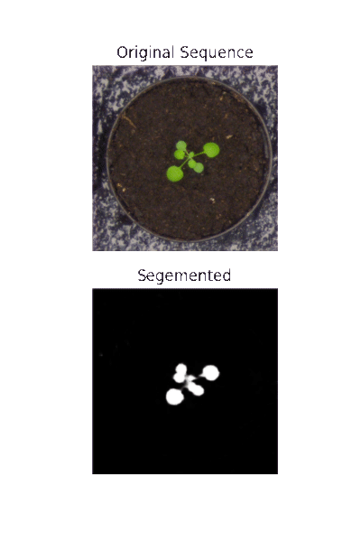

## Plant Vision

Fine-tuning a semantic segmentation neural net on plant phenotyping datasets,
collated from botany laboratories around the world.

Training on multiple datasets increases the ability of the trained network to generalize.
This is our goal in deploying networks into the field, resilience to odd conditions, and still giving sensible results.
Field conditions on farms and inside greenhouses can be extreme, and also vary widely in short time spans.
Light levels, moisture, temperature, and other pertinent characteristics of the growing environment are all uncontrolled,
in contrast to laboratory settings.
So to generalize for field conditions, we train on multiple collated datasets with an eye towards appropriate visual transforms
that can improve predictive outcomes even further.

# lowering-the-cost-of-farm-research-cameras

Convincing farmers to adopt new technology, like analytics dashboards and on-farm cameras and sensors, is challenging for a number of reasons, and adds additional complexity to the task of designing the systems themselves. Hardware purpose built for laboratory environments will not withstand the harsh rigors of service in the field, even inside protected structures like greenhouses. Cameras, sensors and other hardware need to be ruggedized against heat and cold, weather, and worst of all, moisture, which short circuits electronics, clouds lenses, and generally wreaks havoc. Hardware in the field also needs to contend with varying conditions, that is, an uncontrolled environment. Light levels vary hugely in the outdoors, even from minute to minute. The biological eye has an enormous dynamic range of many orders of magnitude, which current cameras cannot hope to achieve. Therefore, working within limitations becomes a necessity, and as in the arts, can lead to novel and useful innovations. The most persistent pressure of deploying hardware on farms is cost. Farmers are willing to adopt new technology, and can see the benefits of emerging technologies, but farms are low profit-margin ventures, and farm owners must be strictly frugal in their capital investments in order to stay in the black.

	The benefits of stationary cameras distinguish them from more expensive options. Even inexpensive security cams available on large retailing websites start at around $50 and that doesn’t necessarily include all the needed compute power, programmability, and connectivity desired of an on-farm camera system. Lowering the cost, while maintaining rugged resistance to dust and water is the prime goal. Inspiration for the project comes from many places, including all the creative makers and tinkerers from around the world who share their knowledge online, and especially from the work of other plant computer vision researchers, who do the hard work of building these systems from the ground up.

In their paper on raspberry pi cameras used for plant phenotyping, the Danforth lab in St Louis has significantly reduced the cost of manufacturing a workable plant capture camera. Besides the obvious uses and benefits to research, this platform serves as a good starting point for developing an even lower cost camera that can be deployed commercially, and has the potential to add tremendous value to farms, with the extensive analytics that they will eventually enable. Of course, these analytics, and the foundational algorithms that underlie them, are the interesting part of agricultural data science, but progress on the algorithms has quickly outpaced progress on data capture. The algorithms are essentially ready for deployment on a large scale around the world, but companies that offer services to collect data from farms reliably are only beginning to appear and thrive. Drone photography will likely be the most impactful modality of on-farm photography. But other modalities will have roles to play, based on the particular needs of the farm. Huge acreages will certainly come to rely even more heavily on satellite data, and ‘precision agriculture’, than they already have. But these sorts of analytics are not available to managers of small and medium sized farms. Small farms in particular have difficult hurdles to deployment, simply making the value proposition good enough is a challenge. Therefore, farm cv technologies are going to be rather specialized as they begin to gain traction in the marketplace.

Drone photography is well suited to medium sized tractor farms, for example, a farm growing 5-15 acres of potatoes. Drones, or a single drone on a daily schedule, can survey this area easily, and relay this information to a server, where the analytics are performed, and served to the client normally via a web interface and or a smartphone app. For small mixed operations, like a 2 acre CSA with 40 varieties of plants, drone photography offers less of an obvious value proposition, because 2 acres is an area easily managed on foot by one farmer and a few helpers, and the complexity of a mixed field is difficult to suss out for the existing algorithms. Illustrative of this is the response I received from one old-time farmer with a small cattle operation upon hearing my description the uses of farm computer vision; he said “Our eyes seem to work good enough for all of that, and we can see the whole farm from here anyway.” It’s a valid point. Farmers have an incredibly well attuned sense of what is happening on their farms, on a day to day basis, and sometimes even hour to hour. Seedlings may look droopy in the late afternoon of a hot day, but if the soil is moist enough and the night is going to cool down, it’s not a cause for concern. But drooping without those constraints present may be an indicator of plant stress. Farmers can see an amazing amount, but they can’t see everything, and they certainly don’t have any extra time. The promise of year round camera monitoring of farms is hard to predict, but examples are emerging that show the power of algorithmic systems to alert farmers to issues on their farms, and eventually advise them on possible solutions. Algorithmic data science, when it matures, will be a little similar to the invention of the movie camera, or even the microscope; it simply allows people to see what they could never have seen before: a horse with all four feet in the air mid gallop, or  living creatures so small that they can’t be seen with the naked eye. Augmenting the naked eye with data science means that we can see patterns of such subtlety and interconnectedness that it will seem as though we've turned a microscope onto the world. Properly trained neural nets, along with lots of data cleaning, and other time saving methods, has the potential to reveal previously unknown correlations in nearly any kind of data.

	For farms, this means insight into the growth rates of various crops, in various locations around the farm. It means cost-free predictions of crop yield, and projections of crop yields for a few weeks into the future. It means optimization methods for helping farmers to decide between complex options, like, should you harvest tomorrow at 85% maturity and sell at $1.59/lb or wait one week and sell the crop at 95% maturity, but for $1.49/lb? It’s really not an easy math problem, and farmers don’t have time to spend on this. Intuition for pricing can get you some of the way there, but it’s too complicated an equation to leave to chance. With small margins, farms need to be smart about pricing, and that includes taking into account market timing, and plant health, labor availability, and inclement weather, to name only a few important factors. To a data scientist, this is a well formulated optimization problem, with constraints.

	Automating these decisions for farms, given that the data is available, and possible to analyze, can result in recommender systems and analytics with great power and usefulness in the real world. As an industry, agricultural data science is at the beginning of a rapid growth curve. The potential is huge, but there’s a long way to go. Plants and animals on farms are one of our greatest resources, they mostly take care of themselves, and that is why farms are possible in the first place. But there’s much more we could be doing to help them along, and it start with helping farmers see and document the intricate relationships in their operations. Once they can see the detail, they’ll know what to do, and once a good system is trained on a task, that knowledge can spread through the world for free, and help farmers everywhere, if they can afford the tech. Eventually, the algorithms will be as good as free (at least the non-cutting-edge ones), but the hardware always has a linear growth in cost: deploying 2000 sensors is going to cost roughly twice as much as deploying 1000. But running algorithms is a lot cheaper than that, and can grow as big as you want while remaining cheap. So the challenge becomes, how do you convince farmers to spend money on hardware? Make it cheap, make it reliable in poor conditions, and demonstrate it’s usefulness with simple examples.

# References

[1] Gehan, Malia A., N. Fahlgren, Arash Abbasi, Jeffrey C. Berry, Steven T. Callen, Leonardo Chavez, Andrew N. Doust, Max J. Feldman, Kerrigan B. Gilbert, John G. Hodge, J. Steen Hoyer, Andy Lin, Suxing Liu, Cesar Lizarraga, Argelia Lorence, Michael Miller, Eric Platon, Monica Tessman and Tony Sax. “PlantCV v2: Image analysis software for high-throughput plant phenotyping.” PeerJ 5 (2017): n. pag.

[2] Tovar, Jose C., J. Steen Hoyer, Andy Lin, Allison Tielking, Steven T. Callen, S Elizabeth Castillo, Michael Miller, Monica Tessman, N. Fahlgren, James C. Carrington, Dmitri A. Nusinow and Malia A. Gehan. “Raspberry Pi–powered imaging for plant phenotyping.” Applications in Plant Sciences 6 (2018): n. pag.

[3] Fahlgren, N., Malia A. Gehan and Ivan R. Baxter. “Lights, camera, action: high-throughput plant phenotyping is ready for a close-up.” Current opinion in plant biology 24 (2015): 93-9 .

[4] Mirnezami, Seyed Vahid. “Application of deep learning and machine learning workflows for field-scale phenotyping.” (2020).

[5] Falk, Kevin G, Talukder Zaki Jubery, Seyed Vahid Mirnezami, Kyle A. Parmley, Soumik Sarkar, Arti Singh, Baskar Ganapathysubramanian and Asheesh K Singh. “Computer vision and machine learning enabled soybean root phenotyping pipeline.” Plant Methods 16 (2020): n. pag.

[6]Zheng, Caiwang, Amr H. Abd-Elrahman and Vance M. Whitaker. “Remote Sensing and Machine Learning in Crop Phenotyping and Management, with an Emphasis on Applications in Strawberry Farming.” Remote. Sens. 13 (2021): 531.

[7] Shakoor, Nadia and Todd C. Mockler. “Wireless Fixed Camera Network for Greenhouse-Based Plant Phenotyping.” Methods in molecular biology 2539 (2022): 49-56 .

[8] Lee, Unseok, Sungyul Chang, Gian Anantrio Putra, Hyoungseok Kim and Dong Hwan Kim. “An automated, high-throughput plant phenotyping system using machine learning-based plant segmentation and image analysis.” PLoS ONE 13 (2018): n. pag.

[9] Abbasi, Arash and N. Fahlgren. “Naïve Bayes pixel-level plant segmentation.” 2016 IEEE Western New York Image and Signal Processing Workshop (WNYISPW) (2016): 1-4.

## Predicting crop yields and harvest dates with computer vision

One of the primary difficulties of farming is the correct timing of harvest. This is a critical decision that arises from a combination of factors taken into account by the farmer. They observe their fields or greenhouses, they see the plants growing consecutively for weeks or months, and they assess whether the plant is ready for harvest, or near to ready. A few main factors dominate however, getting the most yield (or value) is typically the goal, while minimizing expenditures (of materials, or time). Other limiting factors exist in farming; getting ahead of an arbitrary weather event is sometimes necessary, by harvesting early (sub-optimally in a normal circumstance) before a storm, or harvesting early before a heat wave,which might kill the plant. Better to harvest at 90% maturity rather than risk losing the whole crop.

Farmers make these decisions based on experience, and continual observation of their crops. They know what a mature plant looks like, from experience and education, and as they observe the plant each day, from day zero when the seed is planted, to day 60 or 90 when the plant should be ready for harvest, they compare how the crop looks to how a mature crop should look. They also take into account those other limiting factors, like avoiding risky weather, pests, financial difficulties, technical problems, labor shortages, all things that could happen in only one day but ruin a season’s crop. Harvests often have to occur in one day, or a single multi-day sprint. Farm workers often work extra long hours during harvest season, and long into the night; it is often that critical to harvest quickly. 

So the way that farmers make these decision are highly complex neural activities based on decades of complex experience, and a huge range of factors, including human factors. So, how can an algorithm hope to correctly predict the maturity of a crop when this is still a difficult problem for humans? By simplifying the problem into it’s fundamental components, and also not asking an algorithm to perform actions better suited for people. The helpful place for limited ai’s is in conjunction with human decision makers. We should expect intelligent predictive algorithms to advise the people who make decisions with really helpful data and analysis, not to make the decisions themselves. So, algorithms on the farm will have difficulty addressing problems arising from human interactions and social systems, because people and communities are so complicated. For instance, a predictive algorithm focused on crop maturity will probably not predict a labor shortage very well. So why should we care? Because sensing things and knowing things is expensive, and agriculture is a very low margin business. In theory, one could measure every aspect of a farm, including all kinds of nlp information and data from historical records, and in general way too much detail, and perhaps a predictive system would function close to perfect, but it would be too expensive. This, on smaller scale, is the problem with complicated systems on farms. Therefore, focusing efforts to solve the problem of harvest prediction on a tractable m,machine learning problem will yield the best and cheapest results.

Computer vision offers a clear path to assessing plant health and maturity, over and above alternative forms of data collection and analysis. It is non-destructive, passive, cheap, durable, and most importantly, extremely information rich. Lets compare the information contained in a photograph of a plant to the information contained in a variety of other sensors, most of which are more expensive have less fidelity that images, as I will claim. Take moisture, temperature, pressure, and wind data as an example. Also consider the example of destructive mass testing, in which harvest weights, or pre-harvest weights are measured directly. Knowing atmospheric conditions near the plant is certainly helpful, but it doesn't tell the farmer anything about the plant weight. It can tell the farmer if conditions around the plant are dangerous to it’s health, but not much more. Destructive weight testing offers detailed data about harvest weights at various points in the life cycle of a plant, but it still requires lots of human intervention to achieve good results on a farm. Using this information, a farmer can construct a rigid plan on harvest timing, and stick to that plan, while minimizing time in the field observing plants.

There’s an old adage in agriculture that says “The best fertilizer is the farmer’s footsteps.” It means that farmers who pay attention to their plants seem to have better results. When a farmer walks their farm every day, and observes the growth of the crops, any change in their health becomes easier to detect. A farmer who puts few footsteps on the field is likely to miss the early signs of pests or other ill health. For our purposes, this adage serves to educate on the importance of frequency of observation. If a crop takes 90 days to mature, and the farmer has time for one farm walk per day, they’ll observe the plant 90 times in it’s life. If they have time for two walks a day, they’ll observe the plant 180 times, more or less evenly spaced throughout time. If they only walk their farm once a week, they only observe the plant 12 times, and therefore have only a fraction of the data to make decisions with. This is a fundamental strength of computer vision programs; they never tire, they can look and record all day long, at whatever resolution and time frequency you want, constrained only by the technology and costs. 

A properly intelligent computer vision system for understanding plant growth will be similar in nature and impact to a microscope or a stop motion photography, which can capture still images of a horse mid-stride, a resolution of information that the human eye and brain cannot necessarily muster. Having a camera permanently trained on a growing plant will allow an algorithm to perceive all kinds of detailed information about the plant, information that a human may never perceive. For instance, analyzing the frequencies and amplitudes of a plant’s motion as it sways around during the day, tracking the sun, imperceptible to a human, may reveal information about the health of the plant. Another example, comparing data over time on the color composition of the leaves will almost certainly be an excellent feature to predict the early onset of crop diseases. I am confident saying this because this is how most farmers around the world assess their plant health, by looking at the color. A plant that is too yellow is not a healthy plant. Now, how accurately can a farmer assess color? A computer vision algorithm can detect changes in color far more subtle than a person. So it stands to reason that a predictive algorithm for plant health could be trained on data features related to leaf color.

## Feature engineering for Optimizing harvest timing
There are three main factors in optimizing harvest timing from a farmers perspective. The importance of this crucial timing decision arises from its large impact on farm profitability; harvesting too late or too early can ruin sales for that harvest, by either selling at too low a price, or too low a harvest weight. So the factors that farmers consider are:
current market price and expected market price over a few weeks or months
harvest yield, usually measured by mass, sometimes by count
specific timing constraints like predefined delivery days, market days, or upcoming inclement weather.
Ie farmers must harvest on Friday if the market they sell at is every Saturday. And farmers must harvest early if a rainstorm threatens to ruin a crop.

Optimizing local contextual decisions should be left to the humans,  things like accounting for market days and labor availability, but predictive models can inform the decision makers about certain critical data, on a daily or near real-time basis.  Of course, simple warnings about weather and recurring calendar events like markets or sales days can be programmed into a simple model that optimizes the timing of tasks on the farm (particularly harvest, planting, transplanting, and cultivating, in that order) but a predictive model can help drastically in the area of plant monitoring. Farmers are wonderfully talented at assessing the overall health and readiness of their plants, but assessing millions of plants is a challenging task for farmers everywhere, and a task that computer vision could theoretically master.

Segmenting leaves is nearly solved, and time series models are coming along quickly; so the question becomes, what are we measuring and why?

I contend that measuring the rate of change of harvestable yield with computer vision can allow for the optimization of harvest timing.

Put in simple English: Allow the crop to grow as long as possible, assuming optimal inputs, until harvest is compelled by either storm or drought, or market/labor readiness, or until the rate of growth slows to the point where the market price will decrease more in one unit of time than the crop will grow. If the market price is currently increasing, even a small decrease in harvest yield could be tolerated. This raises the issue of quality, however, which is intimately related to plant life cycle timing, yet another reason why timing harvest just prior to maturity is a critical decision. The determination is hard because it’s an online learning problem, the farmers only have access to the growth information up until now, not tomorrow, and there’s always a chance that the crop could grow more than expected by tomorrow. Determining when to stop an ongoing process is exceedingly difficult for people, and fundamentally requires calculus. This is why computer vision will excel at prediction crop readiness, assuming it can perceive sufficiently well, for a similar reason that it excels in radiology. The tiny perturbations in data are magnified by well designed ML algorithms, allowing us to see them, and make decisions with better information. Knowing when a crop is nearing maturity is a deceptively complex problem, but data science is going to have a role to play in these decisions, and the success of our future agricultural systems may hinge on it, as the environment becomes hotter and less predictable.

## Semantic Segmentation Training

Training on multiple datasets increases the ability of the trained network to generalize.
This is our goal in deploying networks into the field, resilience to odd conditions, and still giving sensible results.
Field conditions on farms and inside greenhouses can be extreme, and also vary widely in short time spans.
Light levels, moisture, temperature, and other pertinent characteristics of the growing environment are all uncontrolled,
in contrast to laboratory settings.
So to generalize for field conditions, we train on multiple collated datasets with an eye towards appropriate visual transforms
that can improve predictive outcomes even further.

## Tracking Invasive Worms with Machine Learning and Computer Vision

New England has an invasive worm problem, disrupting ecosystems and causing economic damage.
Several visual characteristics of these Pheretimoid earthworms suggest the possibility 
of using computer vision to identify them.
Their color is distinctive, and different from prefered populations of earthworms.
If a training set with accurate contours can be created, a model could be trained to
classify worm instances based on color.
The body proportions are also distinctive, in general longer and less fat than locally adapted earthworms.
The proportion of average pixel length to average pixel width could be useful in identifying them.
The clitellum (the ring around the body) is very light in color, and farther towards the front of the worm.
The average speed of the invasive worm is much higher than that of local earthworm populations in New England and the USA.
This speed can be calculated from several frames of video, provided it is timestamped, and
a length measurement card is visible in the image.
An estimate of the speed of the worm in the above animation is roughly 2 inches/minute, rather slow, making this specimen not likely to be invasive.

## Ethics and the future of agricultural data science:

Every advance in technology presents humanity with a choice as to how it’s implemented, and offers some balance of benefits versus costs. Some technologies are a clear win-win, solar cells for example, they have no moving parts, are cheap to produce, and can generate electricity for decades as long as they're kept fairly clean. The value that solar cells add to humanity’s overall standard of living is incredibly high, and the externalities (the costs in mining, manufacturing, transport, etc) are almost certainly lower than the benefits they provide over time. The same argument is harder to make for burning fossil fuels, even though they contain an amazing amount of energy, the costs are appearing to grow as we take them into account more fulsomely. Making specialty plastics from oilstocks however is an efficient and necessary use of oil. Many indispensable plastics and rubbers used in medicine are made only from petroleum. Until an alternative is invented, we need those plastics to live, even though mining them has large costs. A knife can kill, but more commonly it feeds. All technology is a balance.

Agricultural data science is going to be incredibly powerful. The data collected on farms and the algorithms that analyze the data will provide insights into all kinds of detailed operational processes that are impossible to perceive without meticulous record-keeping and analysis. Subtle and small changes are what data science is good at picking up on. All those changes in a crop that farmers care about can be effectively monitored and tracked with agricultural data science technologies, like sensors, cameras, and algorithms. But along with the benefits to farmers, of more information to make decisions with, comes a range of potential pitfalls, many of which can be classed as problems of human ethics. Let’s discuss a few obvious examples, and then a few unpredictable outcomes.

The most obvious misuse of on-farm data science sensors is potential labor abuses, arising from accidental (or intentional) monitoring of farm employees. Even if such an outcome is never intended, data science algorithms will find most of the correlations present, and this can expose workers to discrimination in a  number of ways. Workers, depending on their municipality, are entitled to certain workplace protections, like mandated break time, lunch time, and safety procedures around machinery and chemicals. All of these policies have important reasons for existing, and all are flouted on a daily basis by a concerning fraction of companies and farms, at least anecdotally. Folks in blue collar jobs do not take regular lunch breaks, and neither do many in white collar jobs, the difference is that those farm labor jobs pay a heck of a lot less, require far more hours, with back-breaking work, and exposure to serious bodily hazards in the workplace. The margins of safety for farm workers are already precariously thin, and providing tools, no matter how good the intentions, that have the potential to be used for illegal monitoring or the intentional flouting of safety procedures, must be taken extremely seriously, and requires an extra level of scrutiny to ensure that potential avenues of abuse are disabled                                                                                             and fixed.

The best way to ensure that data science technologies are safe is designing it into the systems from the very beginning. Once the systems are up and running, it will be too costly to make serious changes. For lack of a better term, we need a culture of accountability within data science, to admit that our systems have the potential to harm, and forestalling that possibility means carefully considering the outcomes of our design choices before we even start building and writing code.

But for an engineer, this is a hard problem, usually we build first and then fix the problems in an iterative cycle, making our code incrementally better each time. How can we predict the outcome of a design process before doing it?

The only way is to learn from history, and to take it’s lessons seriously. All design processes have a similar end, some system or technology interacting with humans, taking information from them, and spreading it around to other people, enabling some new interaction. To predict the outcome of a design process, forget about the design and the tech, and focus on the people. People don’t change very much over time, at least it usually takes a while. People’s psychological motivations are much the same as they were thousand of years ago, it’s simply our concerns that have changed. So to imagine the outcome of a design process, find a similar event in history, and use it as a metaphor. Several historical metaphors come to mind in the execution of farm technologies, most of them with horrifying human costs. The invention of the cotton gin was a blessing, but only made necessary by the enslavement of thousands upon thousands for the production of that fiber. The Luddites found it necessary to smash the machines that threatened their livelihoods, not because they failed to understand the usefulness of the machines, but because they had no choice, it was either riot or starve. As technologies disrupt various industries, giving people choices will alleviate the negative pressures of changing a labor market. So, in farming, what does it mean to give people a choice as their jobs are under threat, or under threat of changing drastically?

It means including them in the new technology, and the riches it creates. It also means actively protecting them from known historical abuses of similar technology. We are witnessing in the early 2020’s an explosion of worker monitoring technologies, visible in examples like delivery drivers, and factory workers, who are subject to increasingly detailed levels of observation. At a certain point, people simply do not want to be surveilled, including at work. When you talk to people about it, they mostly find it distasteful and insulting, as though they're not trusted, when they know full well that the success of the company is literally in their hands every day. Workers are principled, and showing them respect for common human dignity will get you most of the way there in creating buy-in from employees. Employees want to be included in future growth, and contribute to it, just not at the expense of their choices about work lifestyle. Surely, the pandemic has only accelerated the willingness of workers to demand safe and proper conditions of employment.  

In agricultural data science, this means assuring workers that new technologies are not meant to monitor and judge their work, but to give them information and tools that help them do their jobs better. It means including workers in training, and even early in the design process. Most of all it means communicating with people, and demonstrating to them that technologies will never be able to replace trust between people, and every organization needs trust to function. The tech can help us work better, but it can’t replace what farms need to survive, which is the attention of people who really care. In our drive to develop new technologies on the farm, putting people first can never come second.

# References

[1] Pound, Michael P., Jonathan A. Atkinson, Alexandra J. Townsend, Michael H. Wilson, Marcus Griffiths, Aaron S. Jackson, Adrian Bulat, Georgios Tzimiropoulos, Darren M. Wells, Erik Harry Murchie, Tony P. Pridmore and Andrew P. French. “Deep machine learning provides state-of-the-art performance in image-based plant phenotyping.” GigaScience 6 (2016): 1 - 10.

[2] Koh, Joshua C. O., German C. Spangenberg and Surya Kant. “Automated Machine Learning for High-Throughput Image-Based Plant Phenotyping.” bioRxiv (2020): n. pag.

[3] Prat, Javier Ribera. “Image-based Plant Phenotyping Using Machine Learning.” (2019).

[4] Mochida, Keiichi, Satoru Koda, Komaki Inoue, Takashi Hirayama, Shojiro Tanaka, Ryuei Nishii and Farid Melgani. “Computer vision-based phenotyping for improvement of plant productivity: a machine learning perspective.” GigaScience 8 (2019): n. pag.

[5] Adak, Alper, Seth C. Murray, Sofija Božinović, Regan Lindsey, Shakirah Nakasagga, Sumantra Chatterjee, Steven L. Anderson and Scott C. Wilde. “Temporal Vegetation Indices and Plant Height from Remotely Sensed Imagery Can Predict Grain Yield and Flowering Time Breeding Value in Maize via Machine Learning Regression.” Remote. Sens. 13 (2021): 2141.

[6] Yoosefzadeh-Najafabadi, Mohsen, Hugh James Earl, Dan C. Tulpan, John J. Sulik and Milad Eskandari. “Application of Machine Learning Algorithms in Plant Breeding: Predicting Yield From Hyperspectral Reflectance in Soybean.” Frontiers in Plant Science 11 (2020): n. pag.

[7] Jiang, Yu and Changying Li. “Convolutional Neural Networks for Image-Based High-Throughput Plant Phenotyping: A Review.” Plant Phenomics 2020 (2020): n. pag.

[Gutierrez] Gutierrez Ortega, Jorge Alberto, Noah Fahlgren and Malia A. Gehan. “Segmentation of Overlapping Plants in Multi-plant Image Time Series.” (2021).

[Scharr] Scharr, Hanno, Massimo Minervini, Andreas Fischbach and Sotirios A. Tsaftaris. “Annotated Image Datasets of Rosette Plants.” (2014).

[Minervini] Minervini, Massimo, Andreas Fischbach, Hanno Scharr and Sotirios A. Tsaftaris. “Finely-grained annotated datasets for image-based plant phenotyping.” Pattern Recognit. Lett. 81 (2016): 80-89.

[Singh] Singh, Arti, Baskar Ganapathysubramanian, Asheesh K Singh and Soumik Sarkar. “Machine Learning for High-Throughput Stress Phenotyping in Plants.” Trends in plant science 21 2 (2016): 110-124 .

[Taghavi] Taghavi Namin, Sarah, Mohammad Esmaeilzadeh, Mohammad Najafi, Tim B Brown and Justin O. Borevitz. “Deep phenotyping: deep learning for temporal phenotype/genotype classification.” Plant Methods 14 (2017): n. pag.

[Pound] Pound, Michael P., Jonathan A. Atkinson, Alexandra J. Townsend, Michael H. Wilson, Marcus Griffiths, Aaron S. Jackson, Adrian Bulat, Georgios Tzimiropoulos, Darren M. Wells, Erik Harry Murchie, Tony P. Pridmore and Andrew P. French. “Deep machine learning provides state-of-the-art performance in image-based plant phenotyping.” GigaScience 6 (2016): 1 - 10.

[Jiang] Jiang, Yu and Changying Li. “Convolutional Neural Networks for Image-Based High-Throughput Plant Phenotyping: A Review.” Plant Phenomics 2020 (2020): n. pag.

[Nagano] Nagano, Shogo, Shogo Moriyuki, Kazumasa Wakamori, Hiroshi Mineno and Hirokazu Fukuda. “Leaf-Movement-Based Growth Prediction Model Using Optical Flow Analysis and Machine Learning in Plant Factory.” Frontiers in Plant Science 10 (2019): n. pag.

[Nomura] Nomura, Koichi, Akihiro Takada, Hirosato Kunishige, Yukio Ozaki, Takashi Okayasu, Daisuke Yasutake and Masaharu Kitano. “Long-term and Continuous Measurement of Canopy Photosynthesis and Growth of Spinach.” Environment Control in Biology (2020): n. pag.

[Samiei] Samiei, Salma, Pejman Rasti, Joseph Ly Vu, Julia Buitink and David Rousseau. “Deep learning-based detection of seedling development.” Plant Methods 16 (2020): n. pag.

[Riera] Riera, Luis G, Matthew E. Carroll, Zhisheng Zhang, Johnathon M. Shook, Sambuddha Ghosal, Tianshuang Gao, Arti Singh, Sourabh Bhattacharya, Baskar Ganapathysubramanian, Asheesh K Singh and Soumik Sarkar. “Deep Multiview Image Fusion for Soybean Yield Estimation in Breeding Applications.” Plant Phenomics 2021 (2021): n. pag.